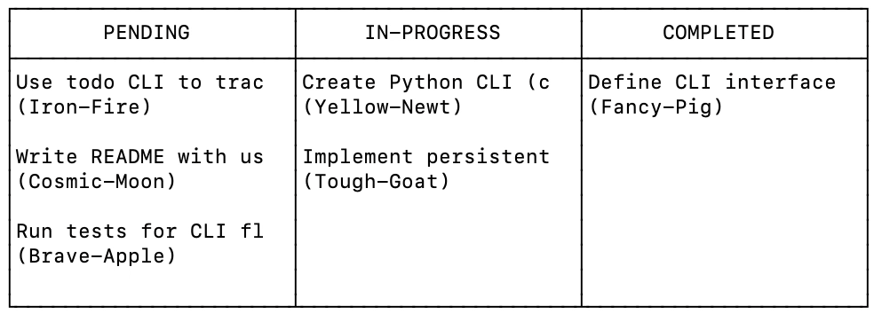
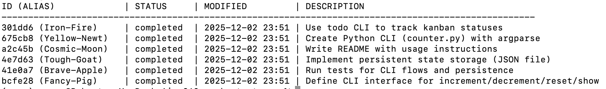

# Todo Tracker

A powerful git-styled CLI-based todo task tracker with versioning, attachments, and Kanban visualization.

Core package badges:


   [](https://pypi.org/project/todo-tracker/) [](https://pypi.org/project/todo-tracker/) [](LICENSE) [](https://pepy.tech/project/todo-tracker) [](https://github.com/gwr3n/todo-tracker/releases) [](https://pypi.org/project/todo-tracker/)

Quality and tooling:

[](https://github.com/psf/black) [](https://github.com/astral-sh/ruff) [](https://github.com/python/mypy)

Project/community:

[](https://github.com/gwr3n/todo-tracker/issues) [](https://github.com/gwr3n/todo-tracker/pulls) [](https://github.com/gwr3n/todo-tracker/stargazers)

Docs:

[](https://github.com/gwr3n/todo-tracker)

## Features

*   **Task Management**: Create, update, and manage tasks with descriptions, deadlines, and statuses.
*   **Versioning**: Every change to a task is versioned. You can view the full history of a task and revert to previous states (conceptually).
*   **Attachments**: Attach files to tasks. Files are stored efficiently using content-addressable storage (deduplication).
*   **Aliases**: Tasks are assigned human-readable aliases (e.g., `Misty-Rat`) for easier reference than UUIDs.
*   **Kanban Board**: Visualize your tasks in a terminal-based Kanban board. 
*   **Archiving**: Archive completed or stale tasks to keep your active list clean.
*   **JSON Dump**: Export your data to [JSON](json/counter_tasks.json) for backup or analysis.
<br>
<br>
<div style="text-align: center;">
    
</div>
<br>
<br>
<div style="text-align: center;">
    
</div>

## Installation

Ensure you have Python 3.8+ installed.

1.  Clone the repository:
    ```bash
    git clone https://github.com/gwr3n/todo-tracker.git
    cd todo-tracker
    ```

2.  Install the package:
    ```bash
    pip install todo-tracker
    ```

## Usage

The main command is `todo`.

### Basic Operations

*   **Add a task:**
    ```bash
    todo add "Buy groceries" --deadline 2023-12-31
    ```

*   **List tasks:**
    ```bash
    todo list
    todo list --all  # Include archived tasks
    ```

*   **Show task details:**
    ```bash
    todo show <task_id_or_alias>
    ```

*   **Update a task:**
    ```bash
    todo update <id> --status "in-progress" --desc "Buy organic groceries"
    ```

### Attachments

*   **Attach a file:**
    ```bash
    todo attach <id> ./path/to/file.txt
    ```

*   **Extract an attachment:**
    ```bash
    todo extract <id> file.txt --output ./downloaded_file.txt
    ```

### Organization & Visualization

*   **Kanban View:**
    ```bash
    todo kanban pending in-progress done
    ```

*   **Archive/Unarchive:**
    ```bash
    todo archive <id>
    todo unarchive <id>
    ```

*   **Delete:**
    ```bash
    todo delete <id>
    ```

### Advanced

*   **View History:**
    ```bash
    todo history <id>
    ```

*   **Duplicate Task:**
    ```bash
    todo duplicate <id>
    ```

*   **Dump Data:**
    ```bash
    todo dump --output backup.json
    todo dump --history --all --output full_backup.json
    ```

## Data Storage

Data is stored in a `.todo_store` directory in the current working directory. This directory contains:
*   `objects/`: Content-addressable storage for task versions and attachment blobs.
*   `refs/`: References to the current version of each task.
*   `orchestrator.lock`: Lock file to ensure data integrity during concurrent access.

## Development

To run tests:

```bash
pytest
```

## License

This project is licensed under the MIT License - see the [LICENSE](LICENSE) file for details.

